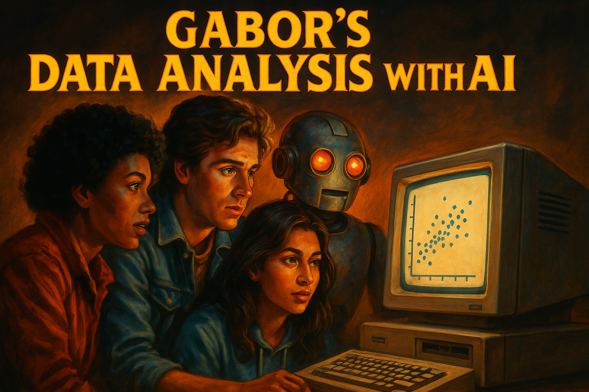

## Data Analysis with AI {.center}

---

## {.center}



---

## About me and this slideshow {.center}

- [I am an economist](https://people.ceu.edu/gabor_bekes) and not an AI developer, expert, guru, evangelist
- I am an active AI user in teaching and research
- I teach a series of Data Analysis courses based on [my textbook](https://gabors-data-analysis.com/)
  - This project is closely related to concepts and material in the book, but can be consumed alone. (or with a drink)
- This slideshow was created to help students and instructors in economics, social science, and public policy who do data analysis. No CS background required.
- Enjoy.

# Hello {background-color="#3b528b" .white .center}

## Use of Artificial Intelligence {.center}

{.r-stretch}

## Why {.center}

::: {.incremental}
- Teaching Data Analysis courses + prepping for 2nd edition of [Data Analysis textbook](https://gabors-data-analysis.com/)

- This is a class to
  - discuss and share ideas of use
  - gain experience and confidence
  - find useful use cases
  - learn a bit more about LLMs and their impact

- Try out different ways to approach a problem
:::

## This class – approach {.center}

::: {.incremental}
- focus on data analysis steps familiar from statistics and econometrics: research question, variable selection, data cleaning, regression, reporting
- move from execution as key skill to design and debugging
- (extra) talk about topics I care about in data analysis
:::

## This class – self-help {.center}

- AI is both amazing help and scary as *SH#T*

::: {.incremental}
- self-help group to openly discuss experience and trauma
- get you some experience with selected tasks
- get you a class you can put into your CV
:::

## Data Analysis with AI 1 – topics and case studies {.center}

- Week 1: Review LLMs – [An FT graph]{style="color: #21918c;"}
- Week 2: EDA and data documentation – [World Values Survey (VWS)]{style="color: #21918c;"}
- Week 3: Analysis and report creation – [World Values Survey (VWS)]{style="color: #21918c;"} [VS Code + GitHub Copilot]{style="color: #21918c;"}
- Week 4: Data manipulation, wrangling – [Synthetic Hotels]{style="color: #21918c;"} [Claude Code]{style="color: #21918c;"}
- Week 5: Regression and diagnostics – [Synthetic Hotels]{style="color: #21918c;"}
- Week 6: Reporting and presentation – [Earnings]{style="color: #21918c;"}

## Data Analysis with AI 2 – topics and case studies {.center}

*(in progress)*

- Week 7: Text analysis and information extraction – [Post match interviews (VWS)]{style="color: #21918c;"}
- Week 8: Different ways of sentiment analysis – [Post match interviews (VWS)]{style="color: #21918c;"}
- Week 9: AI as research companion 1: Control variables
- Week 10: AI as research companion 2: Instrumental Variables
- Week 11: AI as research companion 3: Difference in differences
- Week 12: TBD

## Data Analysis with AI 1 – Applications and focus areas {.center}

- Chat – conversational interface
- Data Analysis – direct code execution / shared canvases
- Context window management
- Tools to connect to sources (Github, Google drive)
- VS Code and Github Copilot
- CLI and Claude Code

## Data Analysis with AI 2 (next course) – Applications and focus areas {.center}

- Talk to AI via API calls
- Skills and context management
  - "my system prompt" (user specific)
  - skills use and generation (gems / prompt template): gabors exploratory data analysis skill (sharable)
- Deep research

# Intro to the concept of LLMs {background-color="#3b528b" .white .center}

## This class is not an LLM class {.center}

Many great resources available online.

This is the best I have seen:

[3blue1brown Neural Network series](https://www.youtube.com/playlist?list=PLZHQObOWTQDNU6R1_67000Dx_ZCJB-3pi)

[Website with more](https://www.3blue1brown.com/)

Assignment: watch them all.

For a full reading list: [Beyond: Readings & Resources](https://gabors-data-analysis.com/ai-course/da-knowledge/beyond.html)

## Key Milestones in LLM Development I {.center}

- **Neural Language Models (2003)**: First successful application of neural networks to language modeling, establishing the statistical foundations for predicting word sequences based on context.

- **Word Embeddings (2013)**: Development of Word2Vec and distributed representations, enabling words to be mapped into vector spaces where semantic relationships are preserved mathematically.

- **Transformer Architecture (2017)**: Introduction of the Transformer model with self-attention mechanisms, eliminating sequential computation constraints and enabling efficient parallel processing.

## Key Milestones in LLM Development II {.center}

- **Pretraining + Fine-tuning (2018)**: BERT — Emergence of the two-stage paradigm where models are first pretrained on vast unlabeled text, then fine-tuned for specific downstream tasks.

- **ChatGPT (2022)**: Release of a conversational AI interface that demonstrated unprecedented natural language capabilities to the general public, driving mainstream adoption.

- **Reinforcement Learning from Human Feedback (2023)**: Refinement of models through human preferences, aligning AI outputs with human values and reducing harmful responses.

## References {.center}

- [1]: Bengio et al. (2003). "A Neural Probabilistic Language Model." JMLR.
- [2]: Mikolov et al. (2013). "Distributed Representations of Words and Phrases." NeurIPS.
- [3]: Vaswani et al. (2017). "Attention Is All You Need." NeurIPS.
- [4]: Devlin et al. (2018). "BERT: Pre-training of Deep Bidirectional Transformers." arXiv.
- [5]: OpenAI. (2022). "ChatGPT: Optimizing Language Models for Dialogue." OpenAI Blog.
- [6]: Anthropic. (2023). "Constitutional AI: Harmlessness from AI Feedback." arXiv.

## What are Large Language Models? {.center background-color="#f8f9fa"}

- Statistical models predicting next words (tokens)
- Transform text/image/video into mathematical space
- Scale (training data) matters enormously
- Pattern recognition at massive scale
- Think of it as a very sophisticated autocomplete trained on every economics paper, textbook, and StackOverflow answer

## LLMs as Prediction Machines {.center}

::: {.incremental}
- **Statistical Framework**: Like a regression that learns patterns from data — but instead of predicting prices from covariates, it predicts the next word from all preceding words
  - Input → Black Box → Predicted Output
- **Key Difference**: Works with unstructured text data
- **Training Process**: Supervised learning at scale
- **Training Material**: "Everything" (all internet + many books)
:::

## Context window {.center}

- 1 token = 4 characters, 4 tokens = 3 words (in English)
- Varies by models and keeps growing
- ChatGPT 2022 window of 4,000 tokens
- 2026 models: 200k–1M tokens (see [Model Comparison](https://gabors-data-analysis.com/ai-course/da-knowledge/which-ai.html))
- A 200k-token window holds your entire WVS codebook, data dictionary, and a full conversation about regression specifications
- Tokens matter – more context, more relevant answers
- Over limit: hallucinate, off-topic.

## Context window – the great differentiator {.center}

- Context window = your chat + uploads + retrieved materials

- LLMs work much better with knowledge in context window

- Think

- Context window: grounded knowledge

- Outside: good but often vague recollection + internet search

## Inference {.center}

**Inference** means generating output based on input and learned patterns

- LLMs generate text by predicting next tokens based on context
- Quality of inference depends on:
  - Model size (parameters)
  - Training data
  - Fine-tuning methods
  - Context window (relevant info)

See [Glossary](https://gabors-data-analysis.com/ai-course/da-knowledge/technical-terms-page.html) for this and 30+ other technical terms

## Reasoning Models {.center}

- **Standard Models**:
  - "Fast thinking". Predicts the next word immediately.
  - Good for creative writing, simple queries.
- **Reasoning Models**:
  - "Slow thinking" — like working through a proof on a whiteboard before giving the answer.
  - **Self-Correction**: Can "backtrack" if it detects a logical error.
  - **Compute-Time Tradeoff**: Spending more time/tokens on *thinking* yields higher accuracy.
  - For data analysis: better at multi-step tasks like checking regression assumptions or designing identification strategies.

## Reasoning Models: What's Actually Happening {.center background-color="#f8f9fa"}

Reasoning steps are *approximate*, not logically guaranteed. The model generates plausible reasoning chains — it can still make errors within them.

Think of it as a student showing their work on an exam. The steps look logical, but you still need to check the answer.

```
Prompt: "I have panel data on firm exports.
Should I use fixed effects or random effects?"

Standard model: "Use fixed effects." (no explanation)

Reasoning model thinks through:
→ "Panel data, firm-level... are firm characteristics
   correlated with the independent variable?"
→ "Likely yes — firm size, location are time-invariant
   but correlated with export decisions"
→ "Hausman test would confirm, but FE is safer default"
→ Answer: "Fixed effects, because..." (with reasoning)
```

**Warning**: The reasoning chain is helpful but not infallible. Always verify the logic — the model may get the econometric reasoning wrong while sounding confident.

## What's new (2025-26) {.center}

[more will be covered in Data Analysis with AI 2]{style="color: #21918c;"}

- **Reasoning-First Models**: "Thinking before answering" is now standard for complex tasks.
- **Agentic Orchestration**: From single chatbots to multi-agent systems coordinating tasks automatically.
- **Native Multimodality**: Models trained natively on text, images, audio, and video — no longer "OCR-ing" images but "seeing" chart pixels directly.
- **From Chat to Work Canvas**: Moving away from linear chat. Working in shared artifacts (Canvases, Projects).

Current model details: [Which AI?](https://gabors-data-analysis.com/ai-course/da-knowledge/which-ai.html)

# Working with LLMs {background-color="#3b528b" .white .center}

## Cyborgs vs Centaurs {.center}

The Centaur and Cyborg Approaches based on *Co-Intelligence: Living and Working with AI* by [Ethan Mollick](https://www.penguinrandomhouse.com/books/741805/co-intelligence-by-ethan-mollick/)

{.r-stretch}

## The Jagged Frontier of LLM Capabilities {.center}

:::: {.columns}
::: {.column width="60%"}
- Many tasks may be considered done by LLM
- Uncertainty re how well LLM will do them – "Jagged Frontier"
- Some unexpectedly easy, others surprisingly hard
- Testing the frontier for data analysis – this class
:::
::: {.column width="40%"}


::: {style="font-size: 0.4em;"}
Image created Claude.ai
:::
:::
::::

## The Centaur Approach {.center background-color="#f8f9fa"}

:::: {.columns}
::: {.column width="60%"}
- Clear division between human and LLM tasks
- Strategic task allocation based on strengths
- Human maintains control and oversight
- LLM used as a specialized tool
- Quality through specialization
- Better for high-stakes decisions
:::
::: {.column width="40%"}

:::
::::

## The Cyborg Approach {.center background-color="#f8f9fa"}

:::: {.columns}
::: {.column width="60%"}
- Deep integration between human and LLM
- Continuous interaction and feedback
- Iterative refinement of outputs
- Learning from each interaction
- Faster iteration cycles
- More creative solutions emerge
:::
::: {.column width="40%"}

:::
::::

## Analysis Approaches: Centaur vs Cyborg {.center background-color="#f8f9fa"}

| Stage | Centaur 🧑‍💻 | Cyborg 🦾 |
|-------|------------|----------|
| **Plan** | 👤 Design research question & identification strategy / 🤖 Suggest variables | 👤🤖 Interactive brainstorming / 👤🤖 Collaborative refinement |
| **Data Prep** | 👤 Define cleaning rules / 🤖 Execute cleaning code / 👤 Validate | 👤🤖 Iterative cleaning / 👤🤖 Joint discovery and modification |
| **Analysis** | 👤 Choose methods / 🤖 Implement code / 👤 Validate results | 👤🤖 Exploratory conversation / 👤🤖 Dynamic adjustment |
| **Reporting** | 👤 Outline findings / 🤖 Draft sections / 👤 Finalize | 👤🤖 Co-writing process / 👤🤖 Real-time feedback |

## The Orchestrator Approach (2026) {.center}

:::: {.columns}
::: {.column width="60%"}
- Humans define high-level goals and intents (start)
- AI Agents (AI system units) autonomously execute tasks
- Continuous monitoring and adjustment by humans
- Focus on strategy and oversight and review (end)
- Example: "Run a diff-in-diff on state-level policy changes" → agents handle data retrieval, cleaning, estimation, and draft a report
:::
::: {.column width="40%"}


::: {style="font-size: 0.4em;"}
Image created by ChatGPT 5.2
:::
:::
::::

## Evolution of Workflow: From Centaur to Orchestrator {.center}

| Era | Model | Role of Human |
|-----|-------|---------------|
| **2023-24** | **Centaur** | **doer/checker**. Half human, half AI. Human writes code, AI fixes it. |
| **2024-25** | **Cyborg** | **integrated**. Constant feedback loop. |
| **2026+** | **Orchestrator** | **manager**. Human defines intent, **Agents** execute, test, and report. |

## Prompt(ing): 2023–2025 {.center}

- In 2023-24, great deal of belief in prompt engineering as skill
- In 2025 there are still useful concepts and ideas [📍 Week 2]{style="color: #21918c;"}
- But not many tricks.
- Highly relevant response = provide any important details or context.

## Prompting 2026 {.center}

- **Prompting (User Focus)**:
  - Design & Interaction.
  - Start general + iterate OR specify strict constraints.
- **Context Engineering (Developer Focus)**:
  - Success is about *what goes into the context window*, not just how you phrase the question.

## Practical Guidelines {.center}

1. Start with clear task boundaries (Centaur)
2. Gradually increase integration (Cyborg)
3. Many workflows combine both approaches
4. Higher stakes = more control
5. Always validate critical outputs
6. Build experience in AI use [📍 this class]{style="color: #21918c;"}

## Practical Guidelines (2026) {.center}

1. Current LLMs are **very** good but not perfect

- Major gains in coding: AI can write 80-90% of code for standard tasks
- Still some hallucination, errors

2. Can now outsource *some* tasks with *light* supervision
3. Cyborg as well as orchestrator are both in use
4. Supervision and review remain critical – management skills

# Under the Hood {background-color="#3b528b" .white .center}

You don't need to build models. But understanding a few mechanisms helps you use them better.

## System Prompts {.center background-color="#f8f9fa"}

- **System Prompt**: The hidden instruction layer defining the AI's persona and constraints.
  - *User sees*: "Analyze this data."
  - *Model sees*: "**You are a research economist. Use R or Stata. Never interpret correlation as causation. Format output as publication-ready tables.** User: Analyze this data."
- **Role**:
  - Ensures consistency (Persona)
  - Safety guardrails (Constitution)
  - Format enforcement (XML/JSON)

See [Glossary: System Prompt](https://gabors-data-analysis.com/ai-course/da-knowledge/technical-terms-page.html)

## How Training Improved {.center background-color="#f8f9fa"}

Three key methods helped LLMs get much better:

- **RLHF** (Reinforcement Learning from Human Feedback): Models learn from human preferences → more helpful, less harmful responses
- **Mixture of Experts** (MoE): Only part of the model activates per query → efficiency. This is why models can have trillions of parameters and still respond fast
- **Knowledge Distillation**: Smaller "student" models trained to mimic larger "teacher" models → why free tiers can still be decent

See [Glossary](https://gabors-data-analysis.com/ai-course/da-knowledge/technical-terms-page.html) for RLHF, MoE, and other terms

## RAG: Retrieval-Augmented Generation {.center background-color="#f8f9fa"}

- LLMs can handle huge context windows, but you cannot dump everything in
- **RAG**: Dynamic retrieval of relevant parts from a large collection of documents
- **The trade-off**: Long context is best for deep reasoning over a specific set of files. RAG is best for finding needles across a massive library of information
- When you upload a codebook to Claude or ChatGPT, the platform may use RAG behind the scenes to find the most relevant parts

## Tool Use and MCP {.center background-color="#f8f9fa"}

- **The Problem**: LLMs are isolated from your data (files, databases, tools)
- **The Solution**: **MCP (Model Context Protocol)** — an open standard, like a "USB-C for AI applications"
- MCP lets your AI connect to local files, GitHub, and databases — no more copy-pasting code into chat
- Secure by design: user controls what the model can see and do

[More in Data Analysis with AI 2]{style="color: #21918c;"}

## What is an Agent? {.center background-color="#f8f9fa"}

An **agent** is an AI system that can:

- Receive a goal ("Analyze CPS wage data")
- Break it into steps autonomously
- Use tools (run code, read files, search the web)
- Evaluate its own output and retry if needed

Think of it as an RA who can work independently overnight. You give the task in the evening, review the output in the morning.

**Key difference from chat**: In chat, YOU drive every step. With an agent, the AI drives — you set the goal and review.

## Single Agent vs Multi-Agent {.center background-color="#f8f9fa"}

:::: {.columns}
::: {.column width="50%"}
### Single Agent
- One RA does all steps in sequence
- Reads your system prompt, cleans data, runs regression, formats table
- Simpler to set up
- Good for straightforward tasks
- Risk: loses focus on long tasks
:::
::: {.column width="50%"}
### Multi-Agent System
- Several specialized RAs, coordinated by a lead
- "Data Cleaning RA", "Regression RA", "Table-Formatting RA"
- Each sees only what it needs (context isolation)
- Better quality on complex tasks
- This is what Claude Code and Cursor do behind the scenes
:::
::::

## Agentic AI: A Worked Example {.center background-color="#f8f9fa"}

You say to an agent: "Analyze the gender wage gap in CPS data"

```
1. Agent reads your system prompt
   → knows you want R, tidyverse, robust SEs
2. Agent searches for & downloads CPS extract
3. Agent cleans data (drops missing wages, creates
   log(wage), experience², education dummies)
4. Agent runs Mincer regression: log(wage) ~ female +
   educ + exper + exper²
5. Agent adds controls, checks robustness
6. Agent produces publication-ready table
7. Agent writes a short summary of findings
```

**YOU**: Review output, check coefficients make sense, verify sample size, iterate.

The agent does 30 minutes of mechanical work in 2 minutes. Your job shifts from *doing* to *reviewing and directing*.

## Agentic AI: A Worked Example (Multi-agent) {.center background-color="#f8f9fa"}

Multi-agent system:

```
1. Root Agent
   → Reads your system prompt
   → Breaks down task into sub-tasks
   → Assigns to specialized agents
2. Data Agent
   → Finds CPS data, cleans it, creates variables
3. Analysis Agent
   → Runs regression, checks assumptions
4. Reporting Agent
   → Formats table, writes summary
```

These agents are co-ordinated (orchestrated) by the Root Agent, which also manages the context window and ensures each agent has what it needs.

## Agentic Risks {.center background-color="#f8f9fa"}

- **Infinite Loops**: Agents getting stuck trying to fix a bug, burning tokens
- **Shadow Operations**: An agent spinning up resources and forgetting to turn them off
- **Tool Hallucination**: Invoking a tool (e.g., `delete_database`) that doesn't exist or using it wrongly
- **Security**: Terminal use — never give an agent unrestricted access
- **Silent data changes**: An agent could silently drop observations with missing values, changing your sample without telling you

## Cost & Token Economics {.center background-color="#f8f9fa"}

Why does AI cost what it costs?

- **Input tokens**: What you send (prompt + uploaded files). Cheap.
- **Output tokens**: What the model generates. More expensive (~3-5x input).
- **Thinking tokens**: Reasoning models "think" internally. Expensive. Pay tokens you never see.

### Practical implications: save tokens

- Long conversations cost more → **start fresh** when switching tasks
- Uploading a 200-page codebook every message adds up → use **Projects** to persist context
- Reasoning models cost 5-20x more than standard → use them for hard tasks
- Free tiers have daily/weekly limits tied to token budgets

See [Glossary: Tokens](https://gabors-data-analysis.com/ai-course/da-knowledge/technical-terms-page.html)

# What can go wrong {background-color="#3b528b" .white .center}

## Stochastic Parrot {.center}

{.r-stretch}

## Stochastic Parrots {.center}

- Stochastic = when prompted repeatedly, LLMs may give different answers
- Parrot = LLMs can repeat information without understanding
- Philosophy = to what extent do they understand the state of the world?
- [List of words often used by LLMs](https://e-discoveryteam.com/2024/04/05/stochastic-parrots-how-to-tell-if-something-was-written-by-an-ai-or-a-human/)

### Data Analysis
- To what extent running something yields same result? [📍 this class]{style="color: #21918c;"}
- How good are predictions? [📍 this class]{style="color: #21918c;"}

## Hallucination: Prediction Errors {.center background-color="#f8f9fa"}

### Type I Error (False Positive)
- Generating incorrect but plausible information
- Example: Creating a citation to "Acemoglu & Johnson (2007)" that doesn't exist

### Type II Error (False Negative)
- Failing to generate correct information
- Example: Missing a key instrumental variables paper relevant to your research question

### Economic Impact of errors
- Cost of verification (humans, AI), risk assessment

## Hallucination of references {.center}

- AI suggests references that don't exist, or facts that are not true
- Used to be a big problem. It's much less now, but still there. Will always be.

- Newer models trained to prefer truth over plausibility
- Newer models search online for facts
- Content in context window followed strongly

## Big debate on errors and hallucination {.center}

:::: {.columns}
::: {.column width="30%"}
- Is hallucination and errors inherent or may be improved
- Read [Carl T. Bergstrom and C. Brandon Ogbunu: chatgpt isn't hallucinating it's bullshitting, 04.06.2023](https://undark.org/2023/04/06/chatgpt-isnt-hallucinating-its-bullshitting/)
- Even a paper [Michael Townsen Hicks, James Humphries & Joe Slater](https://link.springer.com/article/10.1007/s10676-024-09775-5)
:::
::: {.column width="70%"}

:::
::::

## The issue is important in medicine {.center}

{.r-stretch}

[Medical research](https://www.bjanaesthesia.org.uk/article/S0007-0912(23)00372-0/fulltext)

## Hallucination is reduced. ChatGPT in 2025 April {.center}

{.r-stretch}

## Hallucination is reduced. ChatGPT in 2026 January {.center}

{.r-stretch}

## Reproducibility & Non-determinism {.center background-color="#f8f9fa"}

Same prompt, different day → different output.

- LLMs are **stochastic**: they sample from probability distributions
- Run the same regression prompt twice → may get different variable selection advice
- Temperature setting controls randomness (lower = more deterministic, but never fully)

### Why this matters for data analysis

- Your results should be reproducible. AI-assisted results may not be
- **Mitigation**: Save the exact code AI generates, not just the prompt
- Always re-run the code yourself to verify the output
- Pin your analysis to the generated code, not to the AI conversation

## Automation Bias: The Polished Output Trap {.center background-color="#f8f9fa"}

AI output looks **professional and confident** — even when wrong.

- A beautifully formatted regression table can have the wrong sample size
- A plausible-sounding causal claim can confuse correlation and causation
- Clean LaTeX formatting makes everything look "right"

### The danger for data analysts

- The more polished the output, the less carefully we check it
- This is **automation bias**: trusting the machine because it looks competent
- Mitigation: Check the **numbers**, not the **formatting**
- Same skepticism as a junior RA's first draft

## Data Leakage & Privacy {.center background-color="#f8f9fa"}

What happens to data you paste into AI chat?

- **Free tiers**: Your data may be used for model training (check ToS)
- **Paid tiers**: Generally NOT used for training (Claude Pro, ChatGPT Plus)
- **Enterprise**: Strongest guarantees — zero data retention

See [Which AI? — Security](https://gabors-data-analysis.com/ai-course/da-knowledge/which-ai.html) for tier comparisons

### For social science researchers

- **Never paste PII** (names, addresses, survey respondent IDs) into chat
- Sensitive survey data (health, income, political views) requires extra care
- **IRB implications**: Human subjects – using AI tools may require IRB approval
- **Mitigation**: Anonymize before uploading. Use synthetic data for testing.

## Don't Outsource Your Learning {.center background-color="#f8f9fa"}

### AI is a power tool — not a replacement for thinking.

- If AI writes all your code, you never learn to debug
- If AI picks your method, you never learn research design
- If AI interprets your coefficients, you never build intuition

### A practical test

> If the AI disappears tomorrow, can you still do your job? If not, you're relying too much.

## Don't Outsource Your Learning 2 {.center background-color="#f8f9fa"}

### The self-discipline challenge

- It's tempting to accept the first answer — resist this
- **Use AI to accelerate**, not to skip the learning curve
- Students who rely too much on AI early struggle when problems get novel
- The goal: you should be able to do the work *without* AI, just slower

### This is hard

- This is hard
- Create scenarios where AI is not available

# AI use cases {.center}

## You have already seen many use cases {.center}

Some more ideas

- [Anthropic's list of use cases](https://docs.anthropic.com/en/docs/about-claude/use-case-guides/overview)
- [Google's analytics list](https://cloud.google.com/use-cases/ai-data-analytics)
- [Databricks broader AI Analytics list](https://www.databricks.com/blog/data-ai-use-cases-worlds-leading-companies)

### Economics research

- [Korinek (2024): Generative AI for Economic Research](https://doi.org/10.1257/jel.20231736)
- Impact of AI on workers – [paper collection (2024-06)](https://datainnovation.org/2024/06/evidence-shows-productivity-benefits-of-ai/)

### Some business

- [Thomson Reuters legal](https://blogs.thomsonreuters.com/en-us/innovation/legal-ai-benchmarking-evaluating-long-context-performance-for-llms/)

## AI Use Cases: Student response {.center background-color="#f8f9fa"}

**Same as in 2025 Q2**

- **Code-related tasks:** Used for debugging, finding errors, generating code for visuals/graphs, optimizing code, and explaining code functionality.
  - **Writing and editing:** Used for proofreading, editing writing, generating references/bibliography lists, checking spelling, and for letters
  - **Information processing:** Used for summarising content/information, searching for literature or researchers' names, and finding sources.

**New for 2026 Q1**

- **Learning and understanding:** Used to explain concepts not understood from class, find tutorials for more coverage on topics, address confusion in material, and break down complex assignment texts into clear steps.
- **General assistance:** Used as a general "assistant" for tasks like thesis work, projects, data analysis, data cleaning, interview preparation, and translation.

## How I use it? {.center}

### Tools

- All the time, ChatGPT 5.2 (Canvas), Claude 4.5 (Projects), Gemini 3.0 all paid tiers.
- I often try around models
- Github Copilot in VSCode and Rstudio (less)
- Use Claude Code (a lot) + Claude Cowork

### Approach

- Idea generation and development
- Code generation and debugging
- Less so in writing

## How I plan to use it {.center}

### Experimentation

- OpenRouter and OpenCode
- Open weights model (Qwen 3, Kimi) on a local computer
- Learn more on building agents

## What were bad experience with AI? {.center}

### Topics

- Background work
- Coding
- Discussion of topics, results
- …

## My bad experience {.center}

- AI written text is typically
  - Good grammar
  - Convincing structure
  - Bland and unoriginal
- One paragraph or one page is hard to tell apart from a human
- 10 pages, 10 papers – easy to see

# Practical topics {background-color="#3b528b" .white .center}

## AI in center vs Human in center {.center background-color="#f8f9fa"}

:::: {.columns}
::: {.column width="50%"}
### AI centric
- Data cleaning code
- Formatting tables and charts
- Explaining error messages
- Translating between R/Stata/Python
- First draft of descriptive analysis
- Literature search (with verification)
:::
::: {.column width="50%" style="color: #d62828;"}
### Human centric
- Choosing your research question
- Causal identification strategy
- Interpreting coefficients
- Policy recommendations
- Ethical judgment calls
- Anything you can't verify yourself
:::
::::

## AI in center vs Human in center 2 {.center background-color="#f8f9fa"}

### Two approaches

**AI-centric** Let AI plan, execute, and report. You review and supervise all steps.

**Human-centric** You think. AI suggests. Iterate on plan. Execution is mixed. Full review, multiple rounds likely.

### Rule of thumb

**Rule of thumb**: If you can't tell whether the AI output is right or wrong, you shouldn't be using AI for that task yet.

## Deep Research Mode {.center background-color="#f8f9fa"}

All major platforms now offer a "deep research" or "research" mode:

- AI spends minutes (not seconds) on your question
- Searches dozens of sources, synthesizes, cites
- Produces a structured report with references

### For economics students

- **Literature review**: "What papers use diff-in-diff to study minimum wage effects after 2020?"
- **Dataset discovery**: "What publicly available panel datasets cover firm-level innovation in Europe?"
- **Prior art check**: "Has anyone analyzed the effect of X on Y using Z method?"

### Caveats

- Always verify the citations exist (hallucination risk!)
- Better as a starting point than a final answer
- Great for thesis brainstorming and background research

# Ethics and Law {.center}

## Copyright {.center}

U.S. Copyright Office 2025 Jan report [Copyright and Artificial Intelligence Part 2: Copyrightability](https://www.copyright.gov/ai/Copyright-and-Artificial-Intelligence-Part-2-Copyrightability-Report.pdf): copyright protection is intended for human-created works.

::: {.callout-note}
"Do not provide sufficient human control to make users of an AI system the authors of the output. Prompts essentially function as instructions that convey unprotectable ideas. While highly detailed prompts could contain the user's desired expressive elements, at present they do not control how the AI system processes them in generating the output."
:::

## Ethics {.center background-color="#f8f9fa"}

### AI was created by using (stealing?) human knowledge

- NYT [sued OpenAI](https://www.cnbc.com/2023/12/27/new-york-times-sues-microsoft-chatgpt-maker-openai-over-copyright-infringement.html)

### Is it Okay to use "Everything" as training material?

- Read essay by [Robin Sloan](https://www.robinsloan.com/lab/is-it-okay/)

## AI in research {.center}

### Use of Artificial Intelligence in AER

::: {.callout-note}
Artificial intelligence software, such as chatbots or other large language models, may not be listed as an author. If artificial intelligence software was used in the preparation of the manuscript, including drafting or editing text, this must be briefly described during the submission process, which will help us understand how authors are or are not using chatbots or other forms of artificial intelligence. Authors are solely accountable for, and must thoroughly fact-check, outputs created with the help of artificial intelligence software.
:::

## AI in research: Elsevier {.center}

Two key points from [Elsevier policy](https://www.elsevier.com/about/policies-and-standards/generative-ai-policies-for-journals) generative AI policies for journals

- report for transparency
- supervise, take responsibility

## Use of Artificial Intelligence in classes {.center}

{.r-stretch}

- [A Harvard lab](https://aicodeofconduct.mlml.io/)

## You gotta stay a learning human {.center}

{.r-stretch}

# Conclusions and discussion {.center}

## AI is widely adopted in business {.center}


Source: [McKinsey Digital](https://www.mckinsey.com/capabilities/mckinsey-digital/our-insights/the-economic-potential-of-generative-ai-the-next-productivity-frontier)

## To learn more {.center}

- [Model comparison & selection](https://gabors-data-analysis.com/ai-course/da-knowledge/which-ai.html)
- [Glossary of technical terms](https://gabors-data-analysis.com/ai-course/da-knowledge/technical-terms-page.html)
- [Readings & resources](https://gabors-data-analysis.com/ai-course/da-knowledge/beyond.html) where I collect blog posts, videos, books, papers

## Gabor's current take I {.center}

### Should study

- You have to learn stuff even if AI can also do it.
  - Good writing
  - Core coding
- Be a well rounded educated human
- Because to supervise AI you need to know what to look for

### Use of AI – need to report?

- My view in 2024. Report what you have done
- My view in 2025. No need to report, AI is now like internet search (or electricity)

## Gabor's current take II {.center}

### Your place with AI

- AI as input, supervision, debugging, responsibility.
- Without core knowledge you can't interact
- Strong knowledge and experience helps debugging

### Future: more opportunities

- Cheaper data analysis = more use cases

## Status {.center}

- This is version 0.6.1
- Last updated: 2026-02-16

[bekesg@ceu.edu](mailto:bekesg@ceu.edu)
